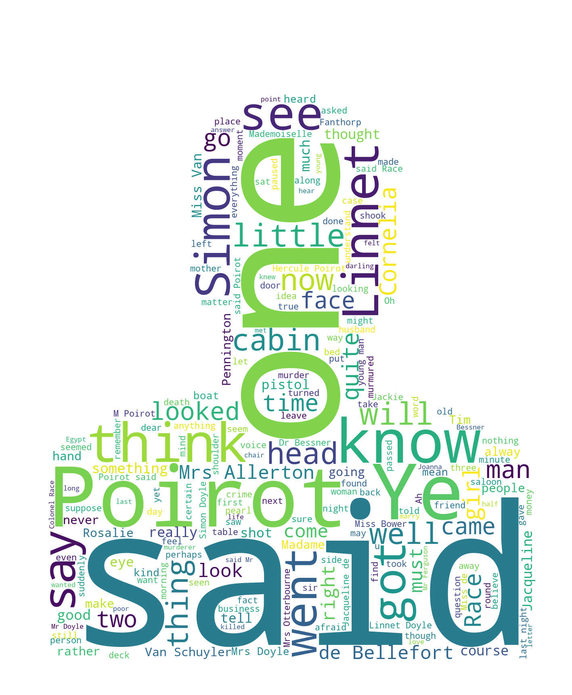

# ☁️ WordCloud GUI Project

A simple and interactive **WordCloud Generator** built with Streamlit. Upload your text file and optionally a mask image to create beautiful word cloud visualizations.


## ✨ Features

- 📄 **Text File Upload** - Upload any `.txt` file to generate word clouds
- 🎭 **Custom Mask Support** - Use PNG/JPG images as masks for shaped word clouds
- 🖼️ **Side-by-Side View** - Compare normal and masked word clouds simultaneously
- 🎨 **Beautiful UI** - Clean, modern interface with responsive design

## 🚀 Demo

| Normal WordCloud | Masked WordCloud |
|------------------|------------------|
|  |  |

## 📦 Installation

1. **Clone the repository**
   ```bash
   git clone https://github.com/prembhanudas-cmyk/Wordcloud_GUI_Project.git
   cd Wordcloud_GUI_Project
   ```

2. **Install dependencies**
   ```bash
   pip install streamlit wordcloud pillow numpy
   ```

## 🎯 Usage

1. **Run the application**
   ```bash
   streamlit run wordcloud_gui.py
   ```

2. **Open your browser** and navigate to `http://localhost:8501`

3. **Upload files**
   - Upload a text file (`.txt`) from the sidebar
   - Optionally upload a mask image (PNG/JPG) for shaped word clouds

4. **Generate** - Click the "Generate WordCloud" button

## 📁 Project Structure

```
Wordcloud_GUI_Project/
├── wordcloud_gui.py      # Main Streamlit application
├── normal_wordcloud.png  # Sample normal word cloud output
├── mask_wordcloud.png    # Sample masked word cloud output
└── README.md             # Project documentation
```

## 🛠️ Dependencies

| Package | Purpose |
|---------|---------|
| `streamlit` | Web application framework |
| `wordcloud` | Word cloud generation |
| `pillow` | Image processing |
| `numpy` | Array operations for mask handling |

## 📝 How It Works

1. **Normal WordCloud**: Generates a standard rectangular word cloud with the `viridis` colormap
2. **Masked WordCloud**: Uses your uploaded image as a shape mask with the `plasma` colormap and adds a contour outline

## 🤝 Contributing

Contributions are welcome! Feel free to:
- Open issues for bugs or feature requests
- Submit pull requests with improvements

## 📄 License

This project is open source and available under the [MIT License](LICENSE).

---

Made with ❤️ using Streamlit
